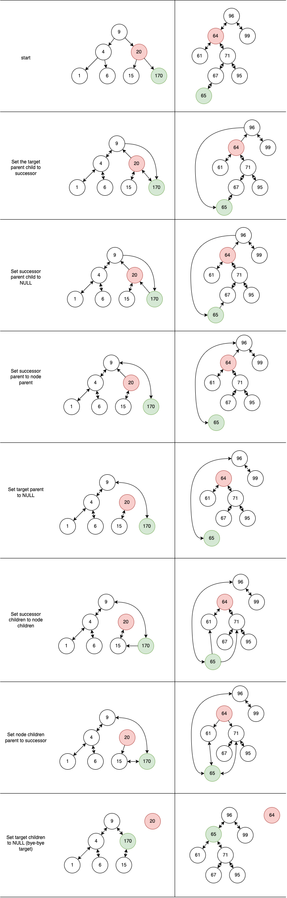

# Section 10: Data Structures: Trees

$log(n)$ is like the height of a tree.

### Binary Search Tree

All child nodes to the right are greater than their parent.
All child nodes to the left are less than their parent.
A node can only have max 2 children (a "binary" tree).

#### Balanced vs Unbalanced

https://www.programiz.com/dsa/balanced-binary-tree

A tree is balanced if the height of the left and right sides does not differ by more than 1. Otherwise, it's unbalanced.

Balanced trees are good because lookup/insert/delete operations take $O(\log{n})$ time. Remember, $O(\log{n})$ is like the height of the tree.

Unbalanced trees, on the other hand, lose the above performance benefits because too many nodes can get pushed to one side. Sometimes this turns the tree into one big linked-list (and linked list operations take $O(n)$ time..)

### Binary (Max/Min) Heap

The value of the parent is greater than the values of its children. The order of the children doesn't matter, just as long as they're less than the parent. Often used to make priority queues.

You can have Min Heaps where the top-most element is the lowest, or Max Heaps (like below) where the top element is the highest.

```
     9
   /   \
  6     4
 / \   / \
5   3 2   1
```

To insert elements into a heap, we add to the end, then shift-up until it is in the right place. See the implementation for details.


-----------------------------

Steps for successor replacement during node removal from Binary Search Tree.


