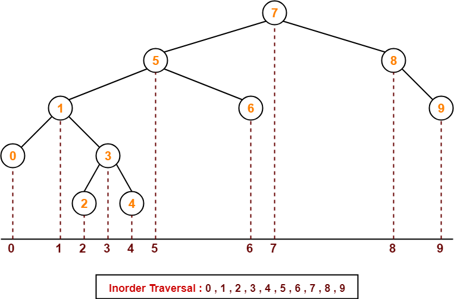

# Section 14: Algorithms: Searching + BFS + DFS

## Algorithms

### Linear Search

Loop through the items one-by-one and check if they match the target value. $O(n)$ time complexity.

### Binary Search

Useful if data is sorted. Time complexity is $O(n\log{n})$.

A sorted array is the same as a binary search tree!
```py
[1, 4, 5, 8, 9, 10, 13]
```
```
     8
   /   \
  4    10
 / \   / \
1   5 9  13
```

Split the numbers in half, compare the values to the left. If they're less than what we're looking for, throw away the left side of the list. Repeat the process with the right side, until the mid-point marker ends up being our target value.

### Breadth First Search (BFS)

Shortest Path / Most related items / Closest friends on Facebook

(See implementation for more details)

* We traverse the nodes from top to bottom, left to right (picture a curtain coming down at the end of a play, or reading a book)
* $O(n)$ time complexity
* Uses more memory than DFS because we need to keep track of many pointers
* Good for finding the shortest path between nodes
* If you know the target node is in the upper level of a tree, use BFS.

```
     8
   /   \
  4    10
 / \   / \
1   5 9  13
```
```py
[8, 4, 10, 1, 5, 9, 13]
```

### Depth First Search (DFS)

"Check to see if relationship exists"

* We go as deep as we can to the left, then once we run out of nodes, start going to the right.
* $O(n)$ time complexity
* $O(\log{n})$ space complexity, because we use recursion to go deep first, so the **height of the tree equal the memory we need**.
* Uses less memory than BFS, but can be slower
* Good for asking the question "does the node exist?"

```
     8
   /   \
  4    10
 / \   / \
1   5 9  13
```
There are 3 ways to perform Depth First Search. The algorithms are basically the same. The only difference is the order of operations.

#### 1. InOrder Traversal

Order of operations:
1. Traverse left
2. Visit node ("in" so in the middle)
3. Traverse right

```py
def traverse_in_order(node):
    if node.left:
        traverse_in_order(node.left)
    print(node)
    if node.right:
        traverse_in_order(node.right)
```

```py
1, 4, 5, 8, 9, 10, 13
```



#### 2. PreOrder Traversal

Order of operations:
1. Visit node ("pre" so first)
2. Traverse left
3. Traverse right

```py
def traverse_in_order(node):
    print(node)
    if node.left:
        traverse_in_order(node.left)
    if node.right:
        traverse_in_order(node.right)
```

```py
8, 4, 1, 5, 10, 9, 13
```

#### 3. PostOrder Traversal

Order of operations:
1. Traverse left
2. Traverse right
3. Visit node ("post" so last)

```py
def traverse_in_order(node):
    if node.left:
        traverse_in_order(node.left)
    if node.right:
        traverse_in_order(node.right)
    print(node)
```

```py
1, 5, 4, 9, 13, 10, 8
```

### BFS/DFS in graphs

With BFS, you check all the closest vertices first, then continue outwards.
With DFS, ...

### Bellman-Ford / Dijkstra Algorithms

Use to find the shortest path in a **weighted** graph.
With normal BFS/DFS we don't consider the edge weights. These 2 algorithms do.

Bellman-Ford can handle negative weights. Dijkstra cannot.
Dijkstra has better time/space complexity than Bellman-Ford.

https://medium.com/basecs/finding-the-shortest-path-with-a-little-help-from-dijkstra-613149fbdc8e

## When to use BFS/DFS

**If you know a solution is not far from the root of the tree:**

BFS, because you always start searching from the root node.

**If the tree is very deep and solutions are rare:**

You'd want to use BFS here, because DFS is gonna take a long time going up and down. However, BFS uses more memory, so if you're concerned about space, DFS might be more appropriate (but probably slower).

**If the tree is very wide:**

You want to use DFS here, because of space complexity. Really wide trees will consume a ton of memory if using BFS.

**If solutions are frequent but located deep in the tree:**

DFS, because we want to check deep nodes first.

**Determining whether a path exists between two nodes:**

DFS, because the nodes may be distant in tree height.

**Finding the shortest path:**

BFS, because going from top to bottom will tell us first the shortest path between the two target nodes.
